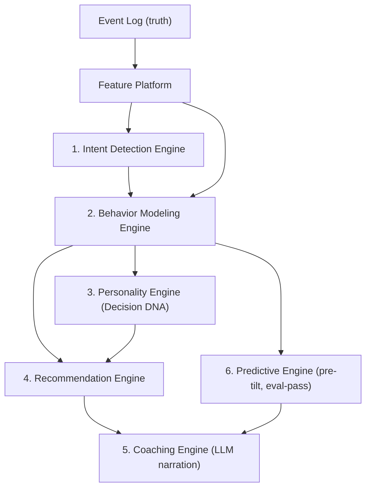

# AI_ARCHITECTURE.md — Split-Roads

> Governing standards in `CLAUDE.md` §3.4: heuristics → models → LLMs; calibration first; provenance on every inference; LLMs narrate, never compute; corrections are gold; honest cold start.

---

## 1. The AI estate at a glance

Six engines, strictly layered — each consumes only validated outputs of the layer below:



The asymmetry that shapes everything: **errors compound downward**. A miscalibrated intent score spawns wrong phantoms, which corrupt behavioral statistics, which corrupt DNA, recommendations, and coaching. Therefore investment, monitoring, and conservatism concentrate at the bottom of the stack.

## 2. Feature platform (shared substrate)

- **One lineage-tracked path** from event log → Parquet exports → feature definitions (versioned code, not ad-hoc SQL) → training sets and online features. Analytics and ML read the same exports (`SYSTEM_ARCHITECTURE.md` §7).
- **Point-in-time correctness is the prime rule**: every feature is computed "as of" a timestamp using only data observable before it. The feature platform API makes lookahead structurally impossible (features take `as_of` as a required argument; market context joins are validated against bar timestamps).
- **Feature families**:
  - *Session features*: event-type counts/sequences, dwell times, ticket-edit trajectories, drawing types, revisit counts, time-of-day, instrument familiarity.
  - *Trader-state features*: rolling P&L, streak state, drawdown depth, time since last loss, session trade count vs personal baseline.
  - *Market-context features*: realized volatility regime, trend state, distance from session open/high/low, scheduled-news proximity.
  - *History features*: per-user base rates (execution rate given ticket-open, historical hesitation rate per setup).
- **Snapshots**: every production inference stores a `feature_snapshot_ref` (S3) — full replay/audit of any score, forever (`intent.scores` schema).

## 3. Engine 1 — Intent Detection

**Task**: for each `IntentSession`, estimate `P(trader intended to execute | observed events)` — continuously, as events arrive, with calibrated probabilities.

### 3.1 v1: transparent heuristic (ships in MVP)

A monotonic scoring function over interpretable signals:

```
intent_score = σ( w₀
  + w₁·ticket_opened          + w₂·size_entered
  + w₃·stop_or_target_set     + w₄·hover_dwell_norm
  + w₅·drawing_at_level       + w₆·alert_at_level
  + w₇·revisit_count_norm     + w₈·user_base_rate_adj
  − w₉·idle_decay(t) )
```

- Weights hand-tuned on founder/beta data; published in-product (explainability is a feature — the user can see *why* we thought they intended).
- Conservative by design: thresholds set for **precision over recall** (a false phantom costs more trust than a missed one). Initial spawn threshold ≈ 0.75 with a "review" band (0.5–0.75) surfaced for user confirmation (`CF-016`/`BX-013` loop).
- Every score row carries `model_id='heuristic@x.y'` + feature snapshot.

### 3.2 v2: learned sequence model

- **Architecture**: small transformer encoder (≈4 layers) over tokenized event sequences — token = (event type, bucketed Δt, bucketed payload features) — concatenated with trader-state and market-context vectors; binary head: executed within session horizon, yes/no. Sized to be unremarkable: this is a tabular-ish sequence problem, not an LLM problem.
- **Labels**: abundant and natural —
  1. *Positive*: session ended in execution (link via `intent.sessions.executed_trade_id`).
  2. *Negative*: session ended `abandoned`/`timeout` with no execution within horizon.
  3. *Gold*: explicit user corrections (`confirmed_intent` / `denied_intent`) — small in volume, decisive for the hard middle band; oversampled in training.
- **Class structure caveat** (the central modeling subtlety): observed labels measure *execution*, not *intent*. An abandoned session with true intent is exactly what we want to detect, and it is labeled negative by signal (1). Mitigations: corrections as gold labels, positive-unlabeled learning treatment of the abandoned class, and human-reviewed evaluation slices of high-score-abandoned sessions. This is documented because naïve retraining on execution labels would teach the model "intent = execution" and silently erase the product's reason to exist.
- **Calibration**: post-hoc isotonic/Platt calibration per asset class; promotion gates on **Brier score** and reliability-curve deviation, not AUC alone (`AI-002`). Target: |observed − predicted| < 5pp per decile bucket.
- **Deployment**: shadow mode behind the heuristic until it beats it on calibration and precision-at-spawn-threshold for two consecutive evaluation windows; then champion/challenger with automatic rollback on drift alerts.

## 4. Engine 2 — Behavior Modeling

**Task**: detect and quantify named behavioral patterns from (events + trades + phantoms): hesitation, premature exit, conviction collapse, FOMO entry, revenge trade, overtrading, stop-tampering, tilt.

- **Approach**: each pattern is a **detector** with three tiers maturing independently — (a) rule-based definition (transparent, shippable, auditable), (b) statistical refinement (per-user baselines, regime conditioning), (c) learned refinement (sequence models over embeddings). Detectors emit *typed pattern instances* with evidence references — never bare scores.
- **Per-user baselines, always.** "Overtrading" is deviation from *your* calibrated norm, not a universal constant. Population statistics provide priors; user data provides the posterior (hierarchical structure shared with the DNA engine, below).
- **Behavioral embeddings** (`AI-003`, Phase 2+): self-supervised encoder over event/trade sequences (next-event prediction + contrastive session similarity). Powers cohorting, anomaly detection (`AI-009`), archetype discovery, and serves as the input representation for tier-(c) detectors.

## 5. Engine 3 — Personality (Decision DNA)

**Task**: maintain the dimensional profile (`dna_dimensions`: conviction, hesitation/fear, FOMO, patience, discipline, risk tolerance, adaptability, consistency, emotional stability, loss aversion, recency bias, overtrading propensity) with score, confidence, and trend per dimension.

- **Model**: hierarchical Bayesian. Each dimension is a latent trait θ_u per user; pattern-instance statistics are noisy observations of θ_u; population distribution per segment (style × market × experience) provides the prior. Small-sample users get **shrinkage toward the population mean with wide credible intervals** — this *is* the honest-cold-start standard, implemented rather than aspired to.
- **Outputs**: posterior mean (score), 90% credible interval (confidence), and windowed delta (trend) — exactly what `profile.dna_snapshots.dimensions` stores. The UI never shows a score without its interval.
- **Validation** (the Phase 2 exit bar): DNA dimensions must demonstrate (a) test-retest stability on stable traders, (b) discriminant validity (dimensions are not all one factor — checked via factor analysis), (c) **predictive validity**: dimension scores at time T must predict behavioral-cost statistics at T+1 out of sample. A profile that predicts nothing is astrology; we publish the validation methodology.
- **Regime conditioning**: dimensions are estimated with market-regime covariates so a volatility spike doesn't read as a personality change. Trait vs state separation: slow-moving trait (the DNA score) + fast session-state estimates (feeds Engine 6).

## 6. Engine 4 — Recommendation

**Task**: map diagnosed patterns to ranked, expected-value-quantified interventions ("a no-entries-after-2-losses rule would have saved you ~2.1R/month, 80% CI [0.7, 3.8]").

- **Method**: a curated **intervention library** (rules, sizing policies, timing constraints — each machine-evaluable), evaluated *counterfactually per user* by replaying their history through the Phantom Engine's policy simulator (`PHANTOM_ENGINE.md` §7). Ranking = posterior expected R-improvement × adoption likelihood (learned from which past recommendations users acted on, `AI-007`).
- **No black-box advice**: every recommendation carries its evidence (the replay distributions) and its assumptions. If the CI spans zero, it is not shown (Law 1 applied to advice).
- Hard boundary inherited from anti-goals: interventions are **behavioral policies over the user's own decisions** — never trade ideas, never instruments to buy.

## 7. Engine 5 — Coaching (LLM narration)

**Task**: convert structured payloads (insights, DNA snapshots, recommendations, weekly aggregates) into personalized, tone-calibrated language; power the weekly report narrative, debriefs, and NL history queries (`AI-012`).

- **The contract**: the LLM receives a JSON payload of pre-computed, pre-gated statistics and a tone profile. Output is validated against the payload — **every numeral in the output must string-match a payload value** (a literal post-generation check, not a hope). Violation = generation rejected and retried; repeated violation = template fallback + alert. Hallucinated statistics are a sev-1 (Standard 4).
- **Tone system**: per-user calibration (direct vs gentle, terse vs explanatory) initialized from onboarding preference, adapted from engagement signals (`AI-007`). Law 4 enforced upstream: loss-framed payloads always include the action field; the prompt forbids shame framing and the output is screened for it.
- **NL queries** compile to a constrained semantic layer (named metrics, named filters) → validated query → computed result → narrated. The LLM never writes raw SQL against user data and never does arithmetic on the answer path.
- **Model strategy**: hosted frontier model via gateway with per-user budget caps; payloads are pseudonymized (no email/name/account identifiers leave the boundary). Swappable by config — narration quality, not model identity, is the product surface.

## 8. Engine 6 — Prediction (forward-looking)

**Task**: pre-tilt session risk (`AI-008`) and prop eval-pass probability (`AI-015`).

- **Pre-tilt**: sequence classifier over the live session prefix (trader-state features + early-session pattern instances) predicting elevated probability of tilt-class behavior in the remainder of the session. Trained on historical sessions labeled by the tier-(a/b) tilt detector — bootstrapping from our own detectors, with human-audited label samples. Deployment is **alert-budgeted**: max one intervention signal per session, threshold tuned for precision (a false tilt alarm mid-session is a Law-5 violation in spirit).
- **Eval-pass**: survival-style model over behavioral trajectories of consented prop cohorts. Phase 4; exists here so its data requirements (cohort outcome labels via firm integrations) are planned from Phase 2 contracts onward.

## 9. Training & online learning strategy

| Stage | Cadence | Mechanism |
|---|---|---|
| Label collection | continuous | natural outcomes (executions, session terminations) + corrections (gold) flow to the label store automatically |
| Dataset builds | weekly | versioned snapshots from Parquet exports; lineage recorded (dataset hash → model card) |
| Retraining | weekly (intent), monthly (behavior/DNA) | scheduled; triggered early on drift alerts |
| Evaluation | every build | frozen eval sets per asset class + rolling latest-month set; calibration suite; slice dashboards (new users, low-volume users, per-platform) |
| Promotion | gated | shadow → challenger → champion; auto-rollback on calibration drift; every promotion is an auditable registry event (`AI-013`) |
| Replay re-scoring | per major version | new champion re-scores historical sessions (append, never overwrite) — the dataset-appreciation loop in action |

**Drift defenses**: per-cohort monitoring (a new broker integration changes event mix), market-regime covariates in evaluation slices, and the standing rule that *population-level behavioral shifts (e.g., a volatility crisis) must widen uncertainty, not silently retrain into a new normal* — regime-tagged training with explicit reweighting decisions, made by humans.

## 10. Evaluation metrics (the scoreboard)

- **Intent**: Brier score (primary), reliability-curve max deviation, precision at spawn threshold, recall in review band, correction overturn rate (how often users deny high-score sessions — the single best end-to-end health number).
- **Behavior detectors**: precision/recall vs human-audited samples (quarterly audit of N=200 instances per detector), per-user baseline stability.
- **DNA**: test-retest reliability, discriminant validity (factor structure), out-of-sample predictive validity vs next-period behavioral costs.
- **Recommendations**: realized vs predicted improvement for adopted interventions (the product's ultimate truth metric), adoption rate, CI honesty (do realized outcomes fall inside stated intervals at the stated rate).
- **Coaching**: payload-fidelity violation rate (target: 0), user-rated usefulness, week-over-week report open/act rates.
- **Business-level North Star for the whole AI estate**: median user's measured behavioral cost (R/month) trajectory after 90 days on platform. Every engine exists to move this.

## 11. Honest risk notes

1. **Intent ≠ execution** (§3.2) is the deepest modeling risk; it has a named owner and a standing eval slice.
2. **Feedback loops**: coaching changes behavior, which changes the data the models train on. This is the *point*, but it means temporal holdouts, not random splits, everywhere — and intervention-aware evaluation (compare against pre-intervention baselines, not pooled history).
3. **Small-N users are most of the funnel.** Every engine must produce honest, useful output at n=10 trades. The hierarchical/shrinkage design is not optional sophistication; it is the activation funnel.
4. **Self-labeled tilt** (§8) can ossify detector biases — the quarterly human audit is the immune system; its budget is protected.
