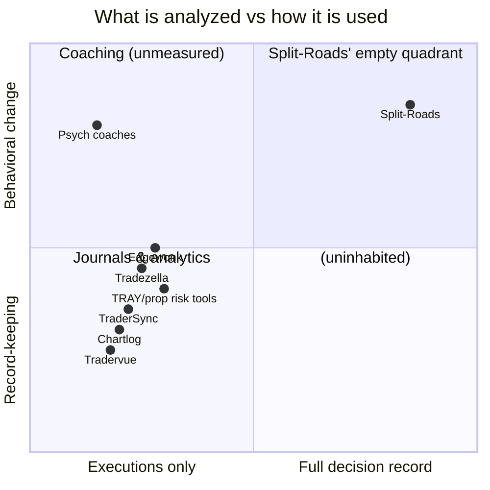

# COMPETITIVE_ANALYSIS.md — Split-Roads

> Framing discipline: our competition is not a company, it is a **category boundary**. Every existing tool analyzes *executed* trades. Split-Roads analyzes *decisions*, of which executions are the visible minority. The analysis below takes each adjacent category seriously, names where they beat us, and states precisely why the boundary protects us.

---

## 1. Category map

## 2. Trading journals (Tradervue, TraderSync, Tradezella, Edgewonk, Chartlog)

**What they are**: import executions, tag setups, chart P&L statistics, write diary notes. Tradezella modernized the UX and proved the market will pay $30–80/mo at meaningful scale; Edgewonk added disciplined trade-quality scoring; TraderSync has the broadest broker coverage.

**Where they genuinely beat us (day one)**: broker-integration breadth (years of connectors), feature completeness in journaling minutiae, established SEO/community presence, simplicity of promise.

**Structural ceiling**: they are *attribution tools over a censored dataset*. The trades that were never taken — statistically the largest behavioral cost center — are invisible to them by construction. Their "psychology" features are self-report fields: the trader writes "felt fearful today," and the tool stores prose. No measurement, no counterfactual, no falsifiability. And because trade history is retroactively importable, they have **no data moat whatsoever** — which is why four near-identical journals coexist on price and UX.

**Why Split-Roads wins**: we subsume their category (our journal must be excellent — Phase 1 commitment) and then make claims they structurally cannot: *hesitation cost, conviction gap, exit quality with counterfactual evidence*. Their users churn to us without losing anything; ours cannot churn to them without losing the only record of their decision behavior. The asymmetry is the strategy.

**Their best counter-move**: bolt on a browser extension and announce "intent tracking." Watch for it. Defense: capture is the easy 10% (see `DATA_MOAT.md` §5) — calibrated inference, honest simulation, and benchmarks are years of corpus they'd start from zero; and their economic incentive is weak (their users aren't asking, and the feature cannibalizes their simplicity).

## 3. Trading analytics / edge-discovery tools (Quantower analytics, EdgeQL-style stats tools, TradesViz)

**What they are**: deeper statistics over the same executed-trade substrate — MFE/MAE, regime splits, Monte Carlo on historical P&L.

**Honest credit**: their statistical sophistication exceeds journals', and their users overlap with our wedge persona.

**Structural ceiling**: same censored dataset; analysis depth cannot fix data absence. Monte Carlo over executed trades answers "how variable is my realized strategy" — never "what is the gap between my intentions and my actions."

**Why Split-Roads wins**: we match their analytical seriousness (uncertainty bands, calibration audits — `PHANTOM_ENGINE.md`) on a dataset they don't have. For the quant-minded retail trader they court, our published methodology *is* the marketing.

## 4. Prop-tech (FTMO/Topstep internal tooling, TRAY, prop risk dashboards, eval platforms)

**What they are**: risk limits, eval-rule monitoring, dashboards over trader P&L and rule breaches; built by or for prop firms whose actual business is trader evaluation at scale.

**Honest credit**: they own the firm relationship, see real order flow at the broker layer, and live closest to our Phase 4 buyer.

**Structural ceiling**: outcome- and breach-centric. They observe rule violations *after* they happen and evaluate traders on small outcome samples — the exact statistical weakness firms complain about. None capture pre-execution intent; none model behavior; none can say "this eval trader's process quality is 80th percentile even though his 25-trade sample is flat."

**Why Split-Roads wins**: we sell the firm what its eval P&L actually depends on — process-quality measurement with precursor alerts rather than post-hoc breach reports — and we arrive with cross-firm benchmarks no single firm can build from its own walls (`EN-003`). The firms' own tooling teams are feature factories, not behavioral-modeling labs; partnering (Phase 5 embeds) is more plausible than their building it.

**Their best counter-move**: a large prop firm builds in-house behavioral scoring on its broker-side data. Defense: single-firm data lacks cross-firm context (their 90th percentile may be the industry's 60th); traders distrust pure-surveillance tooling — our trader-owned consent posture recruits the traders themselves, which a firm tool never will.

## 5. Behavioral-finance & psychology tools (Trading psychologists, TradingPsychologyEdge-style apps, journaling-with-emotions apps, Chartmat-style habit tools)

**What they are**: the only category that shares our thesis — behavior drives outcomes. Ranges from $300/hr human coaching (Steenbarger-school) to mood-tracking journal apps.

**Honest credit**: the human coaches are *right*, and the good ones change traders' careers. They validated the willingness to pay for behavioral work at price points far above SaaS.

**Structural ceiling**: no instrumentation. The entire category runs on self-report — the least reliable data source in behavioral science, collected from subjects who are by definition poor observers of the behavior in question (that's why they need help). No coach can see the 40 hesitations their client didn't mention; no mood app can quantify what fear cost in R.

**Why Split-Roads wins**: we are not their competitor at first — we are their **measurement layer** (`EN-010`, coach workspace), and they are our distribution channel. Long-run, the coaching engine absorbs the routine layer of their work; the humans move up-stack to what humans do best, with our data underneath. We win by arming them before we automate around them.

## 6. The latent giants (TradingView, brokers, Bloomberg)

The serious threat isn't an incumbent journal — it's a platform that already owns the decision surface deciding to instrument it.

- **TradingView**: owns the charts our extension instruments. Could ship native "intent journaling" tomorrow. Why they likely won't do it *well*: their business is charts, social, and broker referral fees; deep behavioral modeling is a multi-year applied-stats program with no adjacency to their revenue; and their incentive is engagement, which our anti-goals deliberately oppose (a calm reflection product cannibalizes screen time). Our posture: be integration-friendly, move fast on the derived layers they'd need years to grow, and reduce dependence via multi-platform capture + eventually first-party surfaces (`FUT-001`).
- **Brokers**: see real order flow including cancellations — genuine intent fragments. But brokers monetize activity; telling clients "you trade too much" is anti-revenue. Structural conflict of interest is our shield, and their neutrality problem is our partnership pitch ("offer behavioral insight without building it — powered by Split-Roads").
- **Bloomberg/institutional**: owns the professional terminal but has shown no appetite for individual behavioral telemetry; their buyer is the firm, and PM-level behavioral measurement is politically radioactive without the trader-consent architecture we made constitutional. If they ever move, Phase 4 credibility + the consent posture is the defense — and the acquisition conversation, realistically.

## 7. Synthesis — why Split-Roads wins the category

1. **Different substrate, not different features**: every competitor analyzes executions; we capture decisions. Feature races are irrelevant across that boundary — they cannot ship our headline numbers at any engineering budget without first capturing for years.
2. **Subsumption strategy**: we contain a great journal, so switching to us is costless; switching away abandons a non-recreatable behavioral record. Asymmetric churn by design.
3. **Credibility as positioning**: published counterfactual methodology + calibration audits occupy the "statistically honest" high ground that both the journal category (innumerate) and the psychology category (unmeasured) leave vacant.
4. **The channel is the moat's distribution arm**: coaches and prop firms — the two categories closest to our thesis — are converted into distribution before competitors recognize them as channels.
5. **The empty quadrant is empty for a reason that just expired**: full-decision-record × behavioral-change required cheap capture infrastructure and sequence-modeling AI that didn't exist five years ago (`CLAUDE.md` §1.5). We are early to a quadrant whose enabling conditions are new — the correct time to be there.
