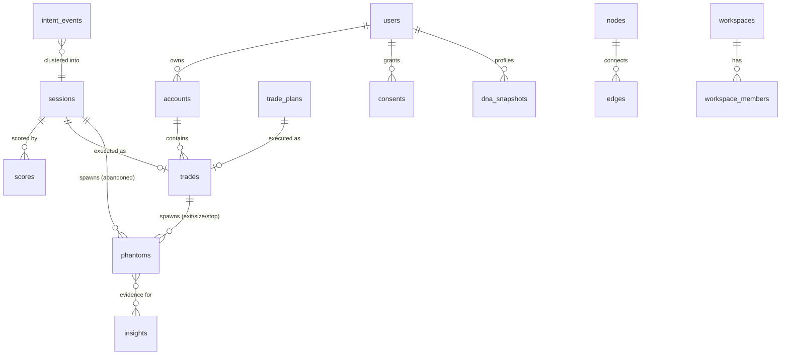

# DATABASE_DESIGN.md — Split-Roads

> System of record: **PostgreSQL 16 + TimescaleDB**. Conventions (from `CLAUDE.md` §3.5): `snake_case`, plural tables, UUIDv7 `*_id` keys, `*_at` UTC timestamps, money/prices as `NUMERIC` (never float), RLS on all tenant-scoped tables.

---

## 1. Schema layout

| Schema | Contents | Character |
|---|---|---|
| `events` | Immutable event log (hypertables) | Append-only, never updated, never deleted (except privacy hard-delete pipeline) |
| `trading` | Trades, positions, plans, accounts, instruments | Mutable system of record |
| `intent` | Sessions, scores | Derived, rebuildable by replay |
| `phantom` | Phantoms, simulation runs, outcomes | Derived, versioned by `sim_version` |
| `graph` | Decision graph nodes/edges | Derived projection |
| `profile` | Decision DNA, insights | Derived projection |
| `core` | Users, workspaces, consent, billing refs, audit | Mutable, RLS-critical |

Derived schemas may be truncated and rebuilt from `events.*` + `trading.*`. That property is tested in CI (replay harness rebuilds `intent.*` for a fixture user and diffs).

## 2. Event storage (`events`)

One physical table per event family, hypertable-partitioned by time, segmented by user.

```sql
CREATE TABLE events.intent_events (
    event_id        UUID        NOT NULL,            -- uuidv7, time-ordered
    user_id         UUID        NOT NULL,
    idempotency_key TEXT        NOT NULL,
    schema          TEXT        NOT NULL,             -- e.g. 'intent.ticket.size_entered'
    schema_version  SMALLINT    NOT NULL,
    source          TEXT        NOT NULL,             -- 'ext.tradingview@1.4.2'
    occurred_at     TIMESTAMPTZ NOT NULL,
    received_at     TIMESTAMPTZ NOT NULL DEFAULT now(),
    instrument_id   UUID        REFERENCES trading.instruments(instrument_id),
    payload         JSONB       NOT NULL,             -- contract-validated upstream
    context         JSONB       NOT NULL DEFAULT '{}'::jsonb,
    PRIMARY KEY (occurred_at, event_id)               -- hypertable requires time in PK
);

SELECT create_hypertable('events.intent_events', 'occurred_at',
                         chunk_time_interval => INTERVAL '7 days');

-- Idempotency guard (48h working window enforced at gateway; DB is the backstop)
CREATE UNIQUE INDEX uq_intent_events_idem
    ON events.intent_events (user_id, idempotency_key, occurred_at);

-- The two real access patterns: per-user timelines, per-user-instrument timelines
CREATE INDEX ix_intent_events_user_time
    ON events.intent_events (user_id, occurred_at DESC);
CREATE INDEX ix_intent_events_user_instr_time
    ON events.intent_events (user_id, instrument_id, occurred_at DESC)
    WHERE instrument_id IS NOT NULL;
CREATE INDEX ix_intent_events_schema
    ON events.intent_events (schema, occurred_at DESC);  -- pipeline/ops queries

-- Compression: events older than 30 days are cold for the product (hot for ML/replay)
ALTER TABLE events.intent_events SET (
    timescaledb.compress,
    timescaledb.compress_segmentby = 'user_id',
    timescaledb.compress_orderby   = 'occurred_at'
);
SELECT add_compression_policy('events.intent_events', INTERVAL '30 days');
-- Tiering to object storage after 12 months (Timescale data tiering / pg_parquet export)
```

`events.trade_events` is structurally identical (different `schema` namespace: `trade.order.filled`, …).

**Partitioning strategy rationale**: time-chunking (7d) matches both retention operations and replay access ("replay user X for March"); `segmentby user_id` makes per-user replay scans cheap post-compression; we do *not* sub-partition by user — per-user volume never justifies it and it would explode chunk counts.

**Privacy hard-delete**: deletion pipeline rewrites affected chunks excluding the user's rows (batch job), then logs a tombstone in `core.deletion_receipts`. This is the *only* sanctioned mutation of `events.*`.

## 3. Trading system of record (`trading`)

```sql
CREATE TABLE trading.instruments (
    instrument_id UUID PRIMARY KEY,
    symbol        TEXT NOT NULL,
    venue         TEXT NOT NULL,
    asset_class   TEXT NOT NULL CHECK (asset_class IN
                  ('equity','futures','fx','crypto','option')),
    tick_size     NUMERIC,
    multiplier    NUMERIC NOT NULL DEFAULT 1,
    currency      TEXT NOT NULL,
    UNIQUE (symbol, venue)
);

CREATE TABLE trading.accounts (
    account_id  UUID PRIMARY KEY,
    user_id     UUID NOT NULL REFERENCES core.users(user_id),
    broker      TEXT NOT NULL,                  -- 'ibkr', 'alpaca', 'mt5.ftmo', 'csv'
    label       TEXT,
    base_currency TEXT NOT NULL,
    credentials_ref TEXT,                       -- KMS-vault pointer; NEVER the secret
    created_at  TIMESTAMPTZ NOT NULL DEFAULT now()
);

CREATE TABLE trading.trades (
    trade_id      UUID PRIMARY KEY,
    user_id       UUID NOT NULL,
    account_id    UUID NOT NULL REFERENCES trading.accounts(account_id),
    instrument_id UUID NOT NULL REFERENCES trading.instruments(instrument_id),
    direction     TEXT NOT NULL CHECK (direction IN ('long','short')),
    opened_at     TIMESTAMPTZ NOT NULL,
    closed_at     TIMESTAMPTZ,                  -- NULL = open
    avg_entry     NUMERIC NOT NULL,
    avg_exit      NUMERIC,
    quantity      NUMERIC NOT NULL,
    fees          NUMERIC NOT NULL DEFAULT 0,
    realized_pnl  NUMERIC,                      -- account base currency
    r_multiple    NUMERIC,                      -- vs initial risk, NULL if no stop known
    plan_id       UUID REFERENCES trading.trade_plans(plan_id),
    setup_tag_ids UUID[] NOT NULL DEFAULT '{}',
    source        TEXT NOT NULL,                -- which connector produced it
    created_at    TIMESTAMPTZ NOT NULL DEFAULT now(),
    updated_at    TIMESTAMPTZ NOT NULL DEFAULT now()
);
CREATE INDEX ix_trades_user_time   ON trading.trades (user_id, opened_at DESC);
CREATE INDEX ix_trades_user_open   ON trading.trades (user_id) WHERE closed_at IS NULL;

CREATE TABLE trading.trade_plans (              -- pre-trade intent, explicit (CF-003)
    plan_id       UUID PRIMARY KEY,
    user_id       UUID NOT NULL,
    instrument_id UUID NOT NULL REFERENCES trading.instruments(instrument_id),
    direction     TEXT NOT NULL CHECK (direction IN ('long','short')),
    planned_entry NUMERIC,
    planned_stop  NUMERIC,
    planned_target NUMERIC,
    planned_size  NUMERIC,
    thesis        TEXT,
    created_at    TIMESTAMPTZ NOT NULL DEFAULT now(),
    expires_at    TIMESTAMPTZ                   -- structural/time validity
);

-- Execution lifecycle detail stays in events.trade_events; trades are the rollup.
```

## 4. Intent projections (`intent`)

```sql
CREATE TABLE intent.sessions (
    session_id    UUID PRIMARY KEY,
    user_id       UUID NOT NULL,
    instrument_id UUID NOT NULL,
    started_at    TIMESTAMPTZ NOT NULL,
    ended_at      TIMESTAMPTZ,
    end_reason    TEXT CHECK (end_reason IN
                  ('executed','abandoned','timeout','ticket_deleted','chart_closed')),
    event_count   INT NOT NULL DEFAULT 0,
    -- denormalized extraction of trade parameters observed during the session:
    inferred_direction TEXT,
    inferred_entry  NUMERIC,
    inferred_stop   NUMERIC,
    inferred_target NUMERIC,
    inferred_size   NUMERIC,
    inference_basis JSONB,        -- which events each parameter came from (provenance)
    executed_trade_id UUID REFERENCES trading.trades(trade_id),
    clusterer_version TEXT NOT NULL
);
CREATE INDEX ix_sessions_user_time ON intent.sessions (user_id, started_at DESC);
CREATE INDEX ix_sessions_unresolved ON intent.sessions (user_id) WHERE ended_at IS NULL;

CREATE TABLE intent.scores (
    score_id    UUID PRIMARY KEY,
    session_id  UUID NOT NULL REFERENCES intent.sessions(session_id),
    scored_at   TIMESTAMPTZ NOT NULL DEFAULT now(),
    intent_score NUMERIC NOT NULL CHECK (intent_score BETWEEN 0 AND 1),
    model_id    TEXT NOT NULL,               -- 'heuristic@1.3' | 'intent-tfm@2.0.1'
    feature_snapshot_ref TEXT,               -- S3 pointer, replay/audit
    user_correction TEXT CHECK (user_correction IN
                  ('confirmed_intent','denied_intent'))  -- BX-013 labels live here
);
CREATE INDEX ix_scores_session ON intent.scores (session_id, scored_at DESC);
CREATE INDEX ix_scores_labels  ON intent.scores (model_id)
    WHERE user_correction IS NOT NULL;       -- training-set extraction
```

Scores are **append-only per session** (a session is rescored as events arrive; history kept). "Current score" = latest row — a deliberate event-sourcing-in-miniature so calibration analysis can see score trajectories, not just finals.

## 5. Phantom storage (`phantom`)

```sql
CREATE TABLE phantom.phantoms (
    phantom_id    UUID PRIMARY KEY,
    user_id       UUID NOT NULL,
    phantom_type  TEXT NOT NULL CHECK (phantom_type IN
        ('ABANDONED_ENTRY','DELAYED_ENTRY','PREMATURE_EXIT','DELAYED_EXIT',
         'CONVICTION','POSITION_SIZE','STOP_PLACEMENT','OPPOSITE_PERSONALITY')),
    status        TEXT NOT NULL DEFAULT 'active' CHECK (status IN
        ('active','resolved','expired','invalidated','pruned')),
    -- provenance: exactly one origin
    origin_session_id UUID REFERENCES intent.sessions(session_id),
    origin_trade_id   UUID REFERENCES trading.trades(trade_id),
    spawn_intent_score NUMERIC,             -- score at spawn time (audit)
    instrument_id UUID NOT NULL,
    direction     TEXT NOT NULL,
    -- counterfactual parameters (what we simulate)
    cf_entry      NUMERIC NOT NULL,
    cf_stop       NUMERIC,
    cf_target     NUMERIC,
    cf_size       NUMERIC NOT NULL,
    cf_policy     JSONB NOT NULL DEFAULT '{}'::jsonb,  -- exit/trailing rules etc.
    param_provenance JSONB NOT NULL,        -- observed | plan | default, per param
    spawned_at    TIMESTAMPTZ NOT NULL,
    expires_at    TIMESTAMPTZ NOT NULL,     -- hard time-stop (see PHANTOM_ENGINE.md)
    resolved_at   TIMESTAMPTZ,
    sim_version   TEXT NOT NULL,
    -- outcome (filled at resolution; distributions, not points)
    outcome_r_p50 NUMERIC,                  -- median R outcome
    outcome_r_p05 NUMERIC,
    outcome_r_p95 NUMERIC,
    outcome_detail JSONB,                   -- path stats: MFE/MAE, bars held, exit reason
    info_value    NUMERIC,                  -- ranking score (SIM-011)
    CONSTRAINT one_origin CHECK (
        (origin_session_id IS NOT NULL)::int + (origin_trade_id IS NOT NULL)::int = 1)
);
CREATE INDEX ix_phantoms_active ON phantom.phantoms (instrument_id, status)
    WHERE status = 'active';                -- bar-close fanout: advance by instrument
CREATE INDEX ix_phantoms_user  ON phantom.phantoms (user_id, spawned_at DESC);
CREATE INDEX ix_phantoms_type  ON phantom.phantoms (user_id, phantom_type, status);
```

Resolved phantoms older than the active analysis window (default 18 months) are archived to Parquet/S3 and deleted from this table; aggregates referencing them are precomputed first (`SIM-010`).

## 6. Decision graph (`graph`)

Postgres adjacency model — a graph database is explicitly deferred (`SYSTEM_ARCHITECTURE.md` §9). Node kinds and the canonical chain: `MARKET_EVENT → ATTENTION → INTENT → ACTION → OUTCOME`.

```sql
CREATE TABLE graph.nodes (
    node_id    UUID PRIMARY KEY,
    user_id    UUID NOT NULL,
    kind       TEXT NOT NULL CHECK (kind IN
               ('MARKET_EVENT','ATTENTION','INTENT','ACTION','OUTCOME')),
    occurred_at TIMESTAMPTZ NOT NULL,
    -- typed reference into the system of record (exactly one set):
    ref_table  TEXT NOT NULL,    -- 'events.intent_events' | 'intent.sessions' |
                                 -- 'trading.trades' | 'phantom.phantoms' | 'market.snapshots'
    ref_id     UUID NOT NULL,
    summary    JSONB NOT NULL    -- denormalized display payload for the explorer
);
CREATE INDEX ix_nodes_user_time ON graph.nodes (user_id, occurred_at DESC);
CREATE INDEX ix_nodes_ref ON graph.nodes (ref_table, ref_id);

CREATE TABLE graph.edges (
    edge_id   UUID PRIMARY KEY,
    user_id   UUID NOT NULL,
    src_node_id UUID NOT NULL REFERENCES graph.nodes(node_id),
    dst_node_id UUID NOT NULL REFERENCES graph.nodes(node_id),
    relation  TEXT NOT NULL CHECK (relation IN
              ('attended','intended','acted','resulted','counterfactual_of','abandoned_into')),
    weight    NUMERIC,           -- e.g. intent_score on 'intended' edges
    UNIQUE (src_node_id, dst_node_id, relation)
);
CREATE INDEX ix_edges_src ON graph.edges (src_node_id);
CREATE INDEX ix_edges_dst ON graph.edges (dst_node_id);
```

Traversals the product actually needs are short, fixed-depth (≤4 hops along the canonical chain) — recursive CTEs serve them comfortably:

```sql
-- "Show the full decision chain that ended in trade :trade_id"
WITH RECURSIVE chain AS (
    SELECT n.*, 0 AS depth FROM graph.nodes n
    WHERE n.ref_table = 'trading.trades' AND n.ref_id = :trade_id
  UNION ALL
    SELECT n.*, c.depth + 1
    FROM chain c
    JOIN graph.edges e ON e.dst_node_id = c.node_id
    JOIN graph.nodes n ON n.node_id = e.src_node_id
    WHERE c.depth < 4
)
SELECT * FROM chain ORDER BY occurred_at;
```

## 7. Profiles & insights (`profile`)

```sql
CREATE TABLE profile.dna_snapshots (
    snapshot_id UUID PRIMARY KEY,
    user_id     UUID NOT NULL,
    as_of       TIMESTAMPTZ NOT NULL,
    window_days INT NOT NULL,               -- rolling window the scores summarize
    dimensions  JSONB NOT NULL,
    -- { "conviction": {"score":0.62,"ci":[0.51,0.73],"n":48,"trend":"+0.04"} , ... }
    model_id    TEXT NOT NULL,
    UNIQUE (user_id, as_of, window_days)
);
CREATE INDEX ix_dna_user ON profile.dna_snapshots (user_id, as_of DESC);

CREATE TABLE profile.insights (
    insight_id  UUID PRIMARY KEY,
    user_id     UUID NOT NULL,
    kind        TEXT NOT NULL,              -- 'hesitation_cost', 'exit_quality', ...
    status      TEXT NOT NULL DEFAULT 'candidate' CHECK (status IN
                ('candidate','published','dismissed','expired')),
    claim       JSONB NOT NULL,             -- structured: metric, value, ci, n, period
    evidence_refs JSONB NOT NULL,           -- phantom_ids / trade_ids backing it
    action      JSONB,                      -- required if loss-framed (Law 4, DB-enforced):
    severity    TEXT NOT NULL CHECK (severity IN ('improvement','neutral','cost')),
    sample_n    INT NOT NULL,
    published_at TIMESTAMPTZ,
    created_at  TIMESTAMPTZ NOT NULL DEFAULT now(),
    CONSTRAINT law1_sample CHECK (status <> 'published' OR sample_n >= 20),
    CONSTRAINT law4_action CHECK (severity <> 'cost' OR action IS NOT NULL)
);
CREATE INDEX ix_insights_feed ON profile.insights (user_id, status, published_at DESC);
```

Note: product Laws 1 and 4 appear here as CHECK constraints — the database is the last line of law enforcement behind `insight-service`.

## 8. Core, consent, tenancy (`core`)

```sql
CREATE TABLE core.users (
    user_id    UUID PRIMARY KEY,
    email      CITEXT NOT NULL UNIQUE,
    password_hash TEXT,                      -- Argon2id; NULL for OAuth-only
    mfa_enabled BOOLEAN NOT NULL DEFAULT false,
    created_at TIMESTAMPTZ NOT NULL DEFAULT now(),
    deleted_at TIMESTAMPTZ                   -- soft mark; hard-delete pipeline follows
);

CREATE TABLE core.consents (
    consent_id UUID PRIMARY KEY,
    user_id    UUID NOT NULL REFERENCES core.users(user_id),
    scope      TEXT NOT NULL,    -- 'capture.ticket','capture.drawings','benchmark.crossuser',...
    granted    BOOLEAN NOT NULL,
    changed_at TIMESTAMPTZ NOT NULL DEFAULT now()
);                               -- append-only: full consent history retained
CREATE INDEX ix_consents_current ON core.consents (user_id, scope, changed_at DESC);

CREATE TABLE core.workspaces (   -- coach/team/firm contexts (Phase 2+)
    workspace_id UUID PRIMARY KEY,
    kind       TEXT NOT NULL CHECK (kind IN ('coach','team','firm')),
    name       TEXT NOT NULL,
    created_at TIMESTAMPTZ NOT NULL DEFAULT now()
);

CREATE TABLE core.workspace_members (
    workspace_id UUID NOT NULL REFERENCES core.workspaces(workspace_id),
    user_id      UUID NOT NULL REFERENCES core.users(user_id),
    role         TEXT NOT NULL CHECK (role IN ('owner','admin','coach','trader','viewer')),
    -- the consent matrix: which field groups this workspace may see for this trader
    visibility   JSONB NOT NULL DEFAULT '{}'::jsonb,
    PRIMARY KEY (workspace_id, user_id)
);
```

**Row-level security** (every tenant-scoped table, from the first migration):

```sql
ALTER TABLE trading.trades ENABLE ROW LEVEL SECURITY;
CREATE POLICY trades_owner ON trading.trades
    USING (user_id = current_setting('app.user_id')::uuid);
-- Workspace read paths are resolved at the API layer against workspace_members.visibility;
-- service roles use SECURITY DEFINER functions, never RLS bypass.
```

## 9. Relationships (overview)



## 10. Operational policies

- **Migrations**: forward-only, reviewed like API changes; `events.*` schemas additionally governed by the contracts package (a migration cannot land without a matching contract version).
- **Backups**: PITR with 30-day window on Postgres; event Parquet exports to S3 are the second, independent copy of the crown jewels.
- **Retention**: events — indefinite (compressed, then tiered); resolved phantoms — 18 months hot, then archive; consent history & audit — indefinite; deleted users — hard-deleted from all stores within 30 days, receipt retained.
- **Replay rebuild drill**: quarterly, rebuild `intent.*` and `graph.*` for a 1% user sample from the log and diff against production projections. Divergence is a sev-2.
