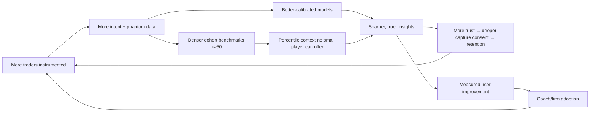

# DATA_MOAT.md — Why Split-Roads Is Difficult to Copy

> The honest framing first: on day one, Split-Roads has **no moat**. The UI is copyable, the architecture is conventional on purpose, and the phantom math is publishable (deliberately — credibility requires it). The moat is not what we build; it is what we *accumulate*, and the central property of what we accumulate is that **it cannot be collected retroactively**.

---

## 1. The structural asymmetry

Every defensible claim below reduces to one fact:

**Intent data only exists if you were instrumenting the trader at the moment of decision.**

Trade history is retroactively importable — any competitor can ingest a user's past trades on day one, which is exactly why trading journals have no data moat and compete on UX and price. Hesitations, abandoned tickets, hover dwell, conviction collapse — these are destroyed at the moment of decision unless captured live. A competitor who starts two years after us is *structurally* two years behind on the only dataset that matters, and money cannot compress that gap: the past is not for sale.

## 2. The four proprietary datasets

### 2.1 The Intent Corpus
Raw decision signals (`IntentEvent` streams), clustered into sessions, with outcomes. Nobody else has this at all — brokers see orders, platforms see clicks but discard them, journals see only executions. Its value compounds in three independent ways: (a) volume (more users × more sessions), (b) **longitudinality** (multi-year behavioral trajectories per trader — the rarest cut), and (c) label density (every session self-labels via execution/abandonment, plus gold correction labels).

### 2.2 The Phantom Corpus
Counterfactual outcomes paired with real decisions — millions of resolved "roads not taken" with uncertainty quantification. Derived, but not trivially reproducible: it requires the intent corpus *plus* the calibrated simulation machinery *plus* the elapsed market time over which phantoms resolved. A copycat with our exact code still needs our inputs and our years.

### 2.3 The Behavioral Outcome Map
The linkage layer: which behavioral patterns, in which trader segments, under which regimes, cost or earn how much — and, from Phase 3, **which interventions actually change behavior, by how much, for whom**. Intervention-response data is the deepest stratum: it requires not just observation but a deployed coaching loop with measured outcomes. This is the dataset that turns Split-Roads from a mirror into medicine, and it cannot exist without years of the loop running.

### 2.4 The Execution-Calibration Set
Predicted vs realized fills on real trades (`PHANTOM_ENGINE.md` §4.3, §6.3). Quietly important: it is what makes our counterfactual math *credibly* conservative rather than asserted conservative, and it requires simultaneously observing intent, simulation, and real executions — a position only we occupy.

## 3. The compounding loops

Three loops, distinct mechanics:

1. **Model loop** (data → calibration → trust → data): classic ML flywheel, but with an unusual booster — the event-sourced architecture means every model improvement re-scores *all historical data* (`CLAUDE.md` §3.1), so the corpus appreciates with each model generation instead of merely growing.
2. **Benchmark loop** (a true network effect): "your hesitation cost is 82nd percentile among futures day-traders with 2–5 years' experience" requires k ≥ 50 matched traders *per cell*. Cell density grows quadratically harder for a late entrant: they need not just users, but users matching every segment. Each new Split-Roads trader makes every existing trader's context sharper — the textbook definition of a data network effect, and one users directly feel.
3. **Distribution loop**: documented improvement → coaches and firms adopt → they bring rosters/cohorts → capture broadens. B2B distribution rides on evidence only the dataset can produce.

## 4. Defensibility, interrogated honestly

For each moat claim: *why is it real, and how could it fail?*

| Claim | Why real | Failure mode & defense |
|---|---|---|
| Intent data can't be backfilled | Physics of capture (§1) | Fails if capture is commoditized by platforms themselves (TradingView ships intent journaling). Defense: integration breadth + the derived layers (models, benchmarks, intervention data) which lag raw capture by years; platforms have repeatedly shown no appetite for behavioral depth — it doesn't sell order flow |
| Model accuracy compounds | Calibration improves with longitudinal volume; corrections are user-generated gold | Fails if intent inference turns out to be easy (generic models suffice). Defense: the hard part is *calibration per trader segment per platform* — exactly what requires our data; publish calibration benchmarks to make the gap visible |
| Benchmarks are quadratically hard to copy | k-anonymity × segmentation cell density | Fails if users don't value percentile context. Early signal suggests they do (traders are obsessively comparative); also feeds B2B evaluation, which firms demonstrably pay for |
| Intervention-response data is years-deep | Requires deployed coaching loop + measured outcomes | Slowest to build, slowest to copy — but only matters if Phase 3 proves interventions work. This is honestly contingent: it is the *bet* of the company, stated as such |
| Trust is a moat | Behavioral data is intimate; consent posture + radical transparency + never-sell-individual-grain are reputational assets compounding over years | Fails catastrophically and instantly with one breach or dark pattern. Hence security baseline + anti-goal 8 ("never sell individual data") as constitutional law, not policy |
| Switching costs | Multi-year behavioral record + DNA history + calibrated personal baselines are non-portable in value even if exportable in bytes (we export freely — the *models'* understanding of you is what can't move) | Weak in year one, strong by year three. Deliberately reinforced by longitudinal features (trend views, year-over-year DNA evolution) |

## 5. What is *not* a moat (resisting self-deception)

- **The phantom concept** — copyable in a hackathon. The concept is marketing; the calibrated corpus is the asset.
- **The UI** — copyable in a quarter.
- **Integrations** — replicable with effort; they are funnel, not fortress.
- **Patents** — we may file on specific simulation/inference mechanics, but in this domain patents deter little; speed and data do.
- **Brand** — *eventually* real ("the behavioral standard"), but only as a lagging consequence of the datasets, never a substitute. The endgame brand asset — the **Split-Roads Score** as an industry-standard behavioral credential (`FUT-005`) — is a network-effect prize unlocked by the data, not by marketing.

## 6. Moat-building as operational discipline

Concrete standing policies, so the moat is built on purpose rather than by accident:

1. **Capture health is paged, not dashboarded** — every silently-lost event is moat erosion (`SYSTEM_ARCHITECTURE.md` §3.4).
2. **Correction UX is a first-class product surface** — label velocity is a tracked, owned KPI (gold labels are the scarcest dataset).
3. **Event schemas are designed for unknown future models** — capture more granularity than today's heuristics use (within consent scopes); today's "unused" field is 2028's feature.
4. **Every phase milestone includes a dataset milestone** (`PRODUCT_ROADMAP.md`) — corpus size, label counts, cell density are exit criteria alongside revenue.
5. **Publish the methodology, keep the calibration** — open math builds credibility and recruits scrutiny; the per-segment calibration tables and trained weights remain proprietary. We give away the recipe's text and keep the years of tasting.
