# PHANTOM_ENGINE.md — Split-Roads

> The Phantom Engine is the counterfactual factory. Its credibility is the platform's credibility: every number it emits must survive scrutiny from a professional quant. This document specifies generation, simulation, lifecycle, ranking, and evaluation — mathematically, with the assumptions stated out loud.

---

## 1. Definitions

A **Phantom** is a versioned, deterministic simulation of a trade that was *not* taken as simulated — either because it was never executed (intent-origin) or because the real trade deviated from a reference policy (trade-origin).

Formally, a phantom is a tuple:

```
Φ = (u, τ, I, d, θ, π, t₀, T, v)
```

- `u` — user; `τ` — phantom type; `I` — instrument; `d` — direction
- `θ = (entry, stop, target, size)` — counterfactual parameters, each with provenance ∈ {observed, plan, default}
- `π` — exit policy (bracket / trailing rule / time stop / reference policy)
- `t₀` — counterfactual decision time (when the simulated trade would have been entered/modified)
- `T` — expiry horizon; `v` — `sim_version`

Its resolution is not a number but a **distribution over R-multiples**, `F_Φ(r)`, arising from execution uncertainty (§4). We persist quantiles `(p05, p50, p95)` plus path statistics (MFE, MAE, bars held, exit reason).

**The cardinal rule (Law 1 made math)**: one `Φ` is a sample, not a finding. Product-level claims are functionals of *collections* of phantoms (§6), reported with interval estimates. No user surface leads with a single phantom's P&L.

## 2. Phantom taxonomy & generation logic

| Type | Origin | Counterfactual question | Spawn trigger |
|---|---|---|---|
| `ABANDONED_ENTRY` | IntentSession | "What if you'd taken the trade you intended?" | session ends `abandoned`/`timeout` ∧ intent_score ≥ s* ∧ θ recoverable |
| `DELAYED_ENTRY` | IntentSession + Trade | "What if you'd entered when you first intended, not when you did?" | execution ≥ δ after first high-intent moment (default δ = 15 min or 1.5× median decision latency) |
| `PREMATURE_EXIT` | Trade | "What if you'd held to plan?" | manual close before plan target/stop, plan or bracket known |
| `DELAYED_EXIT` | Trade | "What if you'd exited per plan instead of overstaying?" | close occurs after plan exit condition was touched |
| `CONVICTION` | Trade | "What if you'd used plan size instead of collapsed size?" | executed size < (1−κ)·plan size (default κ = 0.25) |
| `POSITION_SIZE` | Trade sequence | "What under policy-X sizing?" | batch, per analysis period (not per trade) |
| `STOP_PLACEMENT` | Trade | "What with the original stop?" | stop modified ≥1 time before exit |
| `OPPOSITE_PERSONALITY` | Portfolio | "Your trades under inverted behavioral policy" | batch, Phase 2+, aggregate-only surface |

### 2.1 Parameter recovery (the honesty hierarchy)

For intent-origin phantoms, `θ` is recovered with strict provenance precedence:

1. **Observed**: values typed into the ticket (`ticket.size_entered`, `ticket.stop_modified`) or alert/drawing prices at the inferred level — highest fidelity.
2. **Plan**: an active `trade_plan` for the instrument within validity.
3. **Default**: only for missing *stop/target*, from the user's own historical distribution (median stop distance per setup/instrument class, in ATR units). **If entry direction or approximate entry level cannot be recovered from observed/plan sources, no phantom is spawned.** We never invent the trade itself, only complete its risk parameters — and `param_provenance` records exactly what was completed.

Defaults inflate uncertainty (§4.4): a defaulted stop widens `F_Φ`, honestly.

### 2.2 Spawn decision (expected-information gating)

Spawn iff:

```
intent_score ≥ s*        (precision-tuned threshold, per CLAUDE.md: false phantoms cost trust)
∧ recoverability(θ) ≥ provenance floor
∧ user_phantom_budget not exceeded     (cost + noise control)
∧ expected_info_value ≥ ν              (§5.2)
```

The review band `s ∈ [s_lo, s*)` does not spawn; it asks (`BX-013`), and the answer both spawns (on confirm) and trains (always).

## 3. Branching logic

A single decision episode can imply several counterfactuals. Branching is **deliberately shallow**:

- **Depth 1 only.** Phantoms branch from *reality*, never from other phantoms. Phantom-of-phantom trees (the "multiverse") multiply error, destroy interpretability, and serve narrative rather than measurement — excluded by design (anti-goal 5).
- **One phantom per (episode, type).** A hesitated entry that was later chased produces one `ABANDONED_ENTRY` (from the abandoned session) *or* one `DELAYED_ENTRY` (if execution followed) — the linker resolves which narrative fits, never both for the same underlying decision (double-counting guard, enforced by a uniqueness key on `(origin, type)`).
- **Composite questions are answered at aggregation time**, not by composite phantoms: "what if patient *and* full-size" is computed by applying both transforms in the policy simulator (§7) over the trade set — a batch evaluation, not a spawned object.

## 4. Simulation methodology

### 4.1 Market model

Simulation advances on **bar closes** (1m base bars aggregated as needed), point-in-time correct, exchange-calendar aware, using only data with `bar_close ≤ t`. No tick-level simulation in Phases 1–3 (cost/fidelity tradeoff documented; intra-bar ambiguity is handled probabilistically, below).

### 4.2 The intra-bar problem (where naïve simulators lie)

A bar that touches both stop and target is ambiguous: which was hit first? Deterministic conventions (e.g., "stop first" always) bias systematically. We treat the intra-bar path as latent:

For a bar with OHLC `(o, h, l, c)` where both stop `s` and target `g` lie within `[l, h]`:

```
P(stop first) is estimated by a path model:
  – baseline: Brownian-bridge approximation between o and c with bar-implied volatility,
    P(τ_s < τ_g | o, c, h, l) computed by first-passage simulation
  – calibrated: empirical first-touch frequencies from historical finer-grained data
    (1m bars inside 5m decisions; tick samples where available), bucketed by
    (asset class, relative distances (s−o)/(h−l), (g−o)/(h−l), bar shape)
```

Resolution then becomes a **mixture**: the phantom resolves both branches with the estimated probabilities, contributing both outcomes (probability-weighted) to `F_Φ`. We never silently pick a branch.

### 4.3 Execution model (fills, slippage, costs)

Conservative by published policy — every assumption errs *against* the phantom looking good:

```
fill(entry, side)   = ref_price + ½·spread(I, t) + slip(I, size, t)
fill(stop exit)     = stop_price + slip_stop(I, vol_t)          # stops fill worse
fill(target exit)   = requires trade-through: bar must exceed target by ε(I)
                      (touch alone does not fill a passive target)
costs               = commissions(I) + fees, from the user's actual fee schedule when known
slip(I, size, t)    = α(I, liquidity_bucket) · σ_bar(t) ; size term activates only
                      above per-instrument participation thresholds (retail sizes: minimal)
```

Parameters are per-asset-class tables, versioned with `sim_version`, calibrated against users' *real* fills (we observe actual executions — a calibration asset competitors without execution data lack: predicted-vs-realized fill slippage on real trades tunes `α` continuously).

### 4.4 Uncertainty propagation

Each phantom resolves via Monte Carlo (default N = 256 paths, seeded, stored seed) over:

1. intra-bar first-passage branches (§4.2),
2. slippage draws (§4.3),
3. defaulted-parameter draws — a defaulted stop is sampled from the user's historical stop-distance distribution, not fixed at its median (§2.1).

Output: empirical `F_Φ`; persisted `(p05, p50, p95)` + path stats. **Reporting rule**: user surfaces show medians with bands; aggregates propagate full distributions (§6), not point estimates. If `p05` and `p95` straddle zero, the phantom is *individually inconclusive* and is only ever used inside aggregates.

### 4.5 What we refuse to simulate

Stated limits, published in the methodology page:

- **No market impact beyond the slippage model** — fine for retail/prop sizes; flagged (and phantom suppressed) above participation thresholds.
- **No behavioral interiority**: a `PREMATURE_EXIT` phantom assumes you *could* have held to plan. Whether you would have is precisely the behavioral gap being measured — the phantom quantifies the policy gap, the DNA layer interprets it.
- **No regime transplantation**: phantoms run in the actual market that occurred. We make no claims about other markets.

## 5. Lifecycle

```mermaid
stateDiagram-v2
    [*] --> Active : spawn (gates §2.2)
    Active --> Resolved : exit condition met (stop/target/policy/time-stop)
    Active --> Expired : t > T (horizon)
    Active --> Invalidated : structure broken / corrected by user ("denied_intent")
    Resolved --> Archived : age > hot window (18mo) ∧ aggregates precomputed
    Expired --> Archived
    Invalidated --> [*] : excluded from all statistics, kept as training label
```



### 5.1 Expiration strategy

A phantom must not run forever — an unbounded counterfactual asymptotically becomes "what if you'd bought and held," which answers nothing about the decision. Horizon `T` = min of:

1. **Policy horizon**: bracket resolution (stop or target hit — the natural case);
2. **Time stop**: `k×` the user's median holding period for that setup/timeframe (default k = 3) — the counterfactual inherits the trader's actual trading style;
3. **Structural invalidation**: the level thesis breaks (e.g., entry-defining level cleanly violated before entry would trigger) — for limit-style entries that never fill, the phantom expires `no_fill`, which is itself signal (the setup never offered the entry);
4. **Hard cap**: 30 trading days.

Expired-by-time phantoms resolve at the time-stop exit price (with §4 execution costs) — again the conservative reading.

### 5.2 Pruning & information value

Per-user budgets keep the corpus meaningful (default: 50 active phantoms; overflow prunes lowest expected info value). Information value of `Φ`:

```
IV(Φ) = w_c·intent_confidence · w_d·E[|R_Φ − R_actual|] · w_p·pattern_relevance · w_n·novelty
```

- `intent_confidence`: spawn score (intent-origin) or 1 (trade-origin);
- expected divergence: phantoms that will likely match reality teach nothing;
- `pattern_relevance`: membership in a currently-tracked behavioral pattern for this user (a hesitation-pattern user's `ABANDONED_ENTRY` phantoms are worth more);
- `novelty`: decay on redundant phantoms of the same (setup, type) cell that already has n ≥ 30 resolved samples — marginal information falls with sample size, so the budget shifts to under-sampled cells.

`IV` is also the **ranking strategy** for what surfaces in the Phantom Ledger and feeds insight candidates (`SIM-011`).

## 6. Counterfactual evaluation (the aggregation mathematics)

The product's claims are statistics over phantom–reality pairs. Core quantity, per behavioral channel `c` (hesitation, early exit, sizing, …) over period `P`:

```
BehavioralCost_c(P) = Σ_{Φ ∈ c, P} E[R_Φ] − R_ref(Φ)
```

where `R_ref` is the realized comparator (0 for `ABANDONED_ENTRY` — no trade happened; the actual trade's R for exit/size/stop types). Reported as a distribution: Monte Carlo over each `F_Φ` propagates to a CI on the sum.

### 6.1 Selection-bias control (the intellectually hard part)

Naïve hesitation cost is biased: we only spawn phantoms where intent was *detected*, and detection correlates with setup quality. Two defenses:

1. **Inverse-probability weighting**: phantom contributions weighted by `1/p̂_detect` where `p̂_detect` comes from the intent model's calibration — making the estimate approximately representative of the user's full intent population, not just the confidently-detected slice.
2. **Paired benchmarking**: hesitation cost is *contextualized* against the user's own executed trades in matched cells (same setup tag, regime, time-of-day): "your abandoned setups outperform your executed ones by ΔR = 1.8 [0.6, 3.0]" is a within-user matched comparison — far more robust than absolute counterfactual P&L, and it is the canonical phrasing in product copy.

### 6.2 Minimum-evidence gates (Law 1, quantified)

A behavioral-cost claim is publishable iff: `n ≥ 20` resolved pairs in the cell; the 90% CI excludes zero; and the effect persists under leave-one-out (no single phantom contributes > 30% of the point estimate). Otherwise it remains a `candidate_insight` — accumulating, invisible.

### 6.3 Honesty audit (closing the loop on ourselves)

For `DELAYED_ENTRY` phantoms we possess both the counterfactual *and* an eventual real execution; for limit-entry phantoms we often later observe real fills at the same levels. These overlaps form a standing **backtest of the simulator itself**: predicted fill quality and path outcomes vs realized. Simulator calibration error is tracked as a first-class metric and published. When `sim_version` increments, archived phantoms in the comparison set are re-simulated to quantify the revision.

## 7. The policy simulator (batch counterfactuals)

`POSITION_SIZE` and `OPPOSITE_PERSONALITY` phantoms — and all Recommendation-Engine evaluations (`AI-010`) — share one mechanism: **replay the user's actual trade/intent history through a transformed execution policy** `π'`:

```
π' = g(π_user)   where g ∈ {hold-to-plan, plan-size, vol-scaled size,
                            no-entries-after-2-losses, patience+1σ, ...}
```

Each `g` is a small, machine-evaluable transform over decision episodes; the simulator replays episodes chronologically (compounding, drawdown paths included — sizing changes interact with sequence, so order matters) under §4 execution assumptions. Output: counterfactual equity-curve distribution vs actual.

`OPPOSITE_PERSONALITY` is a *composition* of transforms derived from the user's DNA extremes (their patience inverted, their sizing-collapse removed), Phase 2+, and is surfaced **only** as aggregate distributions per anti-goal 5 — never as a trade-by-trade alternate diary.

## 8. Storage & compute notes

(Operational schema in `DATABASE_DESIGN.md` §5; systems view in `SYSTEM_ARCHITECTURE.md` §5.)

- Advancement is O(instruments × bars), not O(phantoms × ticks): bar-close fanout to instrument-keyed active sets.
- A resolved phantom stores quantiles + path stats + seed, not the 256 paths (re-derivable: deterministic sim + stored seed). Storage per phantom ≈ 1–2 KB hot.
- Replay-driven development applies fully: any `sim_version` change ships with a replay diff over a frozen 6-month fixture corpus, reviewed like a schema migration.

## 9. Why this engine is hard to copy

1. It consumes **intent data competitors don't have** — without capture, there is nothing to simulate.
2. Its execution model is **calibrated on observed real fills** matched to simulated ones — a feedback asset that requires both capture and an execution-linked user base.
3. Its credibility compounds: every published methodology audit (§6.3) raises the bar a copycat must publicly clear.
4. The restraint is the moat too: shallow branching, conservative fills, evidence gates — the discipline that makes quants trust the numbers is product DNA, not a feature a competitor bolts on after shipping a hype-driven "multiverse" toy.
