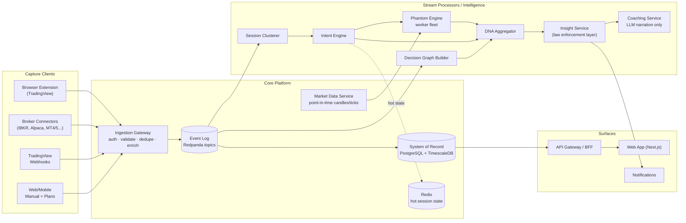
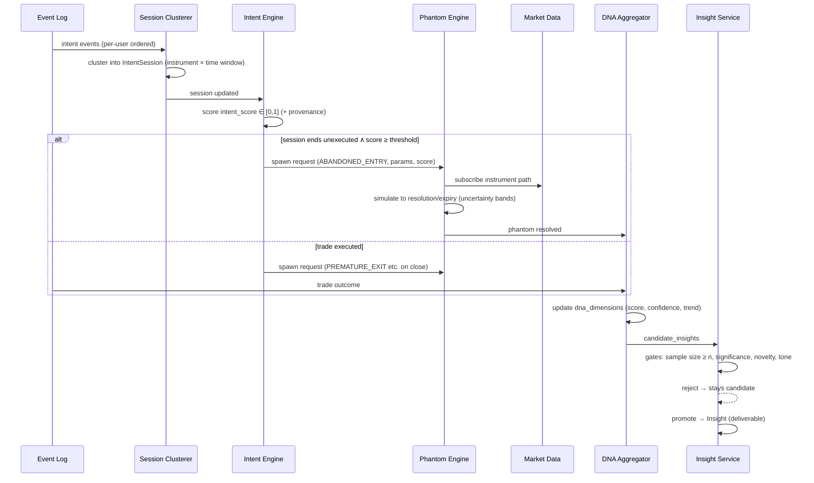

# SYSTEM_ARCHITECTURE.md — Split-Roads

> Companion to `CLAUDE.md` Part III. This is the engineering source of truth for system structure.
> Canonical vocabulary (`IntentEvent`, `IntentSession`, `Phantom`, `DecisionNode`, …) is defined in `CLAUDE.md` §3.5.

---

## 1. Architectural thesis

Split-Roads is **an event-sourcing system over human decisions**. One immutable log of observed behavior; everything else — intent scores, phantoms, the decision graph, Decision DNA, insights — is a derived, disposable, rebuildable projection.

Three properties fall out of this and justify it:

1. **The dataset appreciates.** A 2027 intent model replays 2025 events and re-scores them. Data collected under dumb models becomes smart-model training data for free.
2. **Inference is revisable.** Intent is probabilistic; corrections arrive late; models improve. Mutable "current best guess" state must never be the system of record.
3. **Enterprise auditability.** Firms will ask "what exactly did you observe, and when?" The answer is a log scan, not an apology.

## 2. System overview



Deployment shape: **modular monolith first.** All "services" above are modules with enforced boundaries (separate packages, explicit interfaces, no cross-imports) inside one deployable, except: the **Python ML/simulation services** (separate processes from day one) and the **ingestion gateway** (separately scaled, because capture availability is sacred). Physical decomposition happens when scaling or team boundaries force it — never speculatively.

## 3. Event system

### 3.1 Event taxonomy

Two top-level families, one envelope:

- **`IntentEvent`** — decision signals that are not trades: `chart.opened`, `chart.revisited`, `chart.closed`, `drawing.created` (with kind: support/resistance/trend/fib), `watchlist.added`, `alert.created`, `alert.triggered`, `ticket.opened`, `ticket.size_entered`, `ticket.stop_modified`, `ticket.target_modified`, `ticket.hover_buy`, `ticket.hover_sell`, `ticket.cancelled`, `ticket.deleted`, `order.cancelled`, `plan.created`, `note.intent_declared`.
- **`TradeEvent`** — executions and order lifecycle from brokers: `order.placed`, `order.filled`, `order.partial_fill`, `order.cancelled_at_broker`, `position.opened`, `position.modified`, `position.closed`.

### 3.2 Event envelope

Every event, regardless of family:

```jsonc
{
  "event_id": "uuidv7",            // globally unique, time-ordered
  "idempotency_key": "client-generated, required",
  "schema": "intent.ticket.size_entered",
  "schema_version": 3,             // additive-only evolution; breaking = new version
  "user_id": "uuidv7",
  "source": "ext.tradingview@1.4.2",
  "occurred_at": "RFC3339 UTC, client clock",
  "received_at": "RFC3339 UTC, server clock",
  "instrument": { "symbol": "NQ", "venue": "CME", "asset_class": "futures" },
  "payload": { /* schema-specific, Zod/Pydantic validated */ },
  "context": {                     // enrichment, added by gateway
    "session_hint": null,          // filled later by clusterer
    "market_snapshot_ref": "...",  // pointer to point-in-time market context
    "capture_scopes": ["ticket", "drawings"]
  }
}
```

Rules (enforced in `packages/contracts`, CI-checked):
- Schemas are **additive-only**; field removal/retype = new `schema_version`.
- `occurred_at` vs `received_at` always both stored; clock skew handled at query time, never by rewriting.
- Idempotency: gateway dedupes on `(user_id, idempotency_key)` with a 48h window; replays beyond the window are caught by log compaction keys.
- PII-bearing fields are explicitly tagged in schema definitions; the logging layer scrubs by tag, not by guesswork.

### 3.3 Ordering & delivery semantics

- Partitioning key: `user_id` — per-user total order in the log, which is what session clustering and graph building need. Cross-user order is irrelevant.
- Delivery: at-least-once end-to-end; **every consumer is idempotent** (keyed on `event_id`). Exactly-once is not assumed anywhere.
- Capture clients buffer locally (IndexedDB in the extension) and flush in batches with backoff; capture must survive offline periods and never block the trader's UI (Law 5: <5ms overhead, fire-and-forget).

### 3.4 Backpressure & capture health

- Gateway rate-limits per source token; overflow degrades by *sampling low-information event types first* (hover dwell before ticket edits before orders — a documented priority ladder).
- A `capture-health` monitor tracks expected-vs-observed event rates per user/integration. Silent capture failure is silent moat erosion; it pages, it doesn't just dashboard.

## 4. Intelligence pipelines



Key design points:

- **Session clustering** is windowed by `(user, instrument)` with inactivity timeout (default 45 min, instrument-class tunable) and explicit terminators (trade executed, ticket deleted, chart closed + cooldown). Sessions are derived state — recluster on algorithm change by replay.
- **Intent Engine** is two-tier: heuristic scorer (v1, transparent weights) and learned model (v2+, shadow-deployed behind the heuristic until calibration beats it). Both write scores with full provenance `{model_id, version, feature_snapshot_ref}`. Details in `AI_ARCHITECTURE.md`.
- **Phantom Engine** is a stateless worker fleet consuming a spawn queue; all phantom state lives in Postgres, advancement is event-driven on market data bars (not per-tick polling). Full math in `PHANTOM_ENGINE.md`.
- **Insight Service is the law-enforcement layer**: Law 1 (min sample n ≥ 20, CIs required), Law 4 (loss-framed insights must carry an action), and anti-regret rules are *code in this service*, not guidelines. The coaching LLM sits strictly downstream and can only narrate the structured payloads this service emits.

## 5. Simulation engine (operational view)

(Methodology in `PHANTOM_ENGINE.md`; this section is the systems view.)

- **Market Replay Data Service** is the load-bearing dependency: point-in-time-correct candles (1m base, aggregated up), exchange-calendar aware, survivorship-clean, no lookahead. Phantom simulation is its dominant consumer; design for read throughput (hot instruments cached whole-day in Redis).
- Advancement model: phantoms register interest in `(instrument, resolution)`; a bar-close fanout advances all registered phantoms in batch. Cost scales with `instruments × bars`, not `phantoms × ticks`.
- Determinism: simulation code is versioned (`sim_version` stored on every phantom); same inputs + same version ⇒ identical outputs. Monte Carlo uncertainty uses seeded RNG with stored seeds. This is what makes replay-driven development and audits possible.
- Budget control: per-user phantom caps, information-value pruning (`SIM-010/011`), cold archival of resolved phantoms older than the active analysis window to S3 (queryable via the analytics store).

## 6. Storage architecture

| Store | Holds | Why this store |
|---|---|---|
| Redpanda | Event log transit + replay buffer (retention: weeks) | Kafka API, ops-light; the log's durable home is Timescale |
| PostgreSQL + TimescaleDB | **System of record**: events (hypertables), trades, sessions, phantoms, graph adjacency, DNA profiles, insights, users/billing | One database until proven otherwise; Timescale gives time-partitioning + compression on events |
| ClickHouse (Phase 2+) | Analytical workloads: cross-trader benchmarks, cohort queries, model feature extraction | Columnar scans over billions of events; never system of record |
| Redis | Live intent-session state, market-data hot cache, rate counters | Ephemeral by definition; rebuildable from log |
| S3 | Cold event archive (Parquet), resolved-phantom archive, model artifacts, feature snapshots | Cheap, lineage-friendly |

Schemas, partitioning, and indexes: `DATABASE_DESIGN.md`.

## 7. Analytics architecture

- **Per-user analytics** (dashboards, reports) read from Postgres projections — precomputed by the DNA aggregator and insight service on schedule (hourly) + on-event triggers (trade close, phantom resolve). No user-facing query computes statistics from raw events at request time.
- **Cross-user analytics** (benchmarks, cohorts, research) run on ClickHouse over Parquet exports of the event log; every benchmark query passes through a k-anonymity guard (k ≥ 50) implemented as a query-layer policy, not a convention.
- **Feature extraction for ML** reads the same Parquet exports — analytics and training share one lineage-tracked data path (see `AI_ARCHITECTURE.md` §feature store).

## 8. Observability architecture

- **Tracing**: OpenTelemetry end-to-end with `event_id` as the correlation thread — a single trace follows an event from gateway through clusterer, intent score, phantom spawn, to insight. This is the primary debugging tool for "why did/didn't a phantom appear."
- **Metrics that page**: capture-health deviation per integration; ingestion lag (event `received_at` → durable in Timescale, SLO p99 < 30s); phantom advancement lag vs bar close (SLO p99 < 2 bars); intent calibration drift (weekly Brier vs baseline); insight-gate rejection-rate anomalies.
- **Metrics that inform**: phantom corpus growth, correction rates (label velocity), per-user event volume distributions, simulation compute per phantom.
- **Logging**: structured JSON, PII-scrubbed by schema tags, no payload bodies at INFO. Generic errors outward, detail inward (security baseline, `CLAUDE.md` §3.3).
- **Replay harness as first-class tooling**: `replay --user X --from --to --pipeline intent@v2` is a maintained CLI from Phase 1 — it is how models are validated, bugs are reproduced, and projections are rebuilt.

## 9. Scaling strategy

Scaling order of operations (each step deferred until measured need):

1. **Phase 1 (≤ ~5k users)**: modular monolith + managed Postgres/Redpanda/Redis. The only independently scaled pieces: ingestion gateway and phantom workers (horizontal, queue-depth driven).
2. **Phase 2 (~5k–50k)**: ClickHouse added for analytics; read replicas for dashboard reads; phantom advancement sharded by instrument; extension fleets get regional ingestion endpoints.
3. **Phase 3+ (50k+, B2B fleets)**: physical service extraction along the already-enforced module boundaries (intent, phantom, insight first); per-tenant row-level security graduates to schema-per-firm for large enterprise; event hypertable chunks tiered to S3 with Timescale data tiering.
4. **Load envelope to design against**: an active trader emits ~500–2,000 intent events/day; 10k active traders ≈ ~20M events/day ≈ ~230/s average, ~5k/s burst at market opens. This is comfortably Postgres-scale for years — which is precisely why no exotic infrastructure is justified yet.

**What we deliberately do not build now**: multi-region active-active, tick-level simulation, real-time (<1s) intent scoring, a graph database. Each has a named trigger condition in the ADR backlog; none is met at current scale.

## 10. Security & tenancy (systems view)

- Row-level security on every tenant-scoped table from the first migration; B2B workspaces add a `workspace_id` dimension with per-field visibility resolved at the API layer (the consent matrix is data, not code).
- Broker credentials: encrypted at rest (AES-256-GCM, envelope encryption via KMS), never logged, rotated, scoped to read-only wherever brokers allow.
- All public endpoints: authn required, rate-limited, audit-logged. The audit log is itself an event stream (dogfooding the backbone).
- Extension security: minimal permissions, no remote code, content-script isolation, signed releases; the extension never reads anything outside its declared capture scopes — and the scopes are user-visible strings, not euphemisms.
